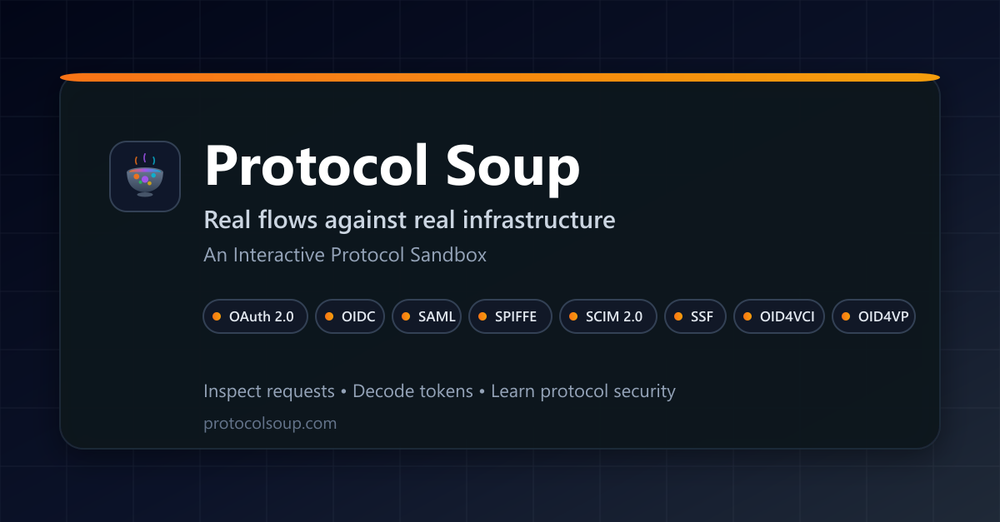

<div align="center">

<p>
  <a href="https://github.com/ParleSec/ProtocolSoup/actions/workflows/ci-cd.yml"></a>
  <a href="https://github.com/ParleSec/ProtocolSoup/releases"></a>
  <a href="LICENSE"></a>
  <a href="https://docs.protocolsoup.com/"></a>
</p>

<p>
  <a href="https://protocolsoup.com"><b>Live Sandbox</b></a>
  &nbsp;·&nbsp;
  <a href="https://wallet.protocolsoup.com">Wallet</a>
  &nbsp;·&nbsp;
  <a href="https://protocolsoup.com/trust">Trust</a>
</p>
<p>
  <a href="https://docs.protocolsoup.com/">Docs</a>
  &nbsp;·&nbsp;
  <a href="https://docs.protocolsoup.com/start-here/quickstart/">Quickstart</a>
</p>

<p>
  <a href="https://protocolsoup.com/trust#conformance"></a>
</p>
<p>
  <a href="https://protocolsoup.com/trust#conformance">OpenID Certified™ by ProtocolSoup for the OID4VCI Issuer, OID4VP Verifier and OID4VP Wallet profiles.</a>
</p>



</div>

<br>

---

<br>

ProtocolSoup is a hands-on sandbox for the protocols that hold identity and access together.

OAuth 2.0, OpenID Connect, SAML, SPIFFE/SPIRE, SCIM, Shared Signals, and the OpenID4VC credential family. Run every flow end to end against a live Mock IdP and watch it happen in the Looking Glass: real wire traffic, real tokens, and real state changes, decoded as they occur.

> [!NOTE]
> **Nothing here is simulated.** Every token is signed by a real key, every request crosses a real network boundary, every state change is real. Fake data teaches fake patterns, and engineers repeat those patterns in production.

<br>

---

<br>

## Quick Start

```bash
git clone https://github.com/ParleSec/ProtocolSoup.git
cd ProtocolSoup/docker
docker compose up -d --build
```

Then open:

- **UI** -- `http://localhost:3000`
- **Gateway API** -- `http://localhost:8080`
- **Health check** -- `http://localhost:8080/health`

Single-service, monolith, and SPIFFE/SPIRE variants are covered in the [quickstart guide](https://docs.protocolsoup.com/start-here/quickstart/).

<br>

---

<br>

## What You Can Do

| Feature | Description |
|---------|-------------|
| **Looking Glass** | Inspect every request and response as it happens, with unredacted payloads |
| **Token Inspector** | Decode tokens, verify signatures, read SAML assertions and credentials |
| **Flow Visualizer** | Animated step-by-step flow diagrams with per-stage timing |
| **Learning Surface** | Parameter explainers, attack and mitigation notes, and spec citations |
| **Search Palette** | Deterministic cmd+K search that explains why every result matched |
| **Mock IdP** | Self-contained provider with generated users, clients, and sessions |
| **Wallet Harness** | Standalone OID4VP wallet for issuance and presentation |
| **Plugin Architecture** | Add protocols without touching core infrastructure |

See [what you can do](https://docs.protocolsoup.com/using/what-you-can-do/) and the [Looking Glass guide](https://docs.protocolsoup.com/using/looking-glass/) for walkthroughs.

<br>

---

<br>

## Protocols

Every flow runs against the real specification. Each protocol links to a guide listing its supported flows, endpoints, and what to validate.

| Protocol | Standards |
|----------|-----------|
| [OAuth 2.0](https://docs.protocolsoup.com/protocols/oauth2) | RFC 6749, 7009, 7523, 7636, 7662, 8414 |
| [OpenID Connect](https://docs.protocolsoup.com/protocols/oidc) | OIDC Core, Discovery |
| [SAML 2.0](https://docs.protocolsoup.com/protocols/saml) | Core, Bindings, Profiles, Metadata |
| [SPIFFE/SPIRE](https://docs.protocolsoup.com/protocols/spiffe) | SPIFFE ID, X.509-SVID, JWT-SVID, Workload API |
| [SCIM 2.0](https://docs.protocolsoup.com/protocols/scim) | RFC 7642, 7643, 7644 |
| [Shared Signals](https://docs.protocolsoup.com/protocols/ssf) | OpenID SSF, CAEP, RISC, RFC 8417, 8935 |
| [OID4VCI](https://docs.protocolsoup.com/protocols/oid4vci) | OID4VCI, SD-JWT VC, JSON-LD Data Integrity, ISO mdoc |
| [OID4VP](https://docs.protocolsoup.com/protocols/oid4vp) | OID4VP, DCQL, ISO 18013-5 |


<br>

---

<br>

## Documentation

The docs site is the source of truth. This README is only an entry point.

- [Start here](https://docs.protocolsoup.com/start-here/overview) - orientation and first run
- [API reference](https://docs.protocolsoup.com/api/overview/) - backed by the contracts in [`openapi/v1/`](openapi/v1)
- [Environment variables](https://docs.protocolsoup.com/deploy/environment-variables/) - every variable, per service
- [Container images](https://docs.protocolsoup.com/deploy/services/overview/) - per-service deployment and configuration
- [Agent discovery](https://docs.protocolsoup.com/deploy/agent-discovery/) - `llms.txt`, API catalog, wallet skill
- [Deployment topologies](https://docs.protocolsoup.com/deploy/deployment-models/) - full stack, single service, monolith, or custom
- [Development setup](https://docs.protocolsoup.com/developers/development-setup/) - prerequisites and the validation matrix
- [Adding a protocol](https://docs.protocolsoup.com/developers/extending/add-a-protocol/) - the plugin walkthrough

In-repo: [CONTRIBUTING.md](CONTRIBUTING.md), [docs/ARCHITECTURE.md](docs/ARCHITECTURE.md), [CHANGELOG.md](CHANGELOG.md), [SECURITY.md](SECURITY.md), [SUPPORT.md](SUPPORT.md).

<br>

---

<br>

## For agents

Fetch these URLs directly rather than scraping the JavaScript UI. The wallet is a separate origin.

- [https://protocolsoup.com/llms.txt](https://protocolsoup.com/llms.txt)
- [https://docs.protocolsoup.com/llms.txt](https://docs.protocolsoup.com/llms.txt)
- [https://wallet.protocolsoup.com/llms.txt](https://wallet.protocolsoup.com/llms.txt)
- [https://wallet.protocolsoup.com/.well-known/agent-skills/use-wallet-harness/SKILL.md](https://wallet.protocolsoup.com/.well-known/agent-skills/use-wallet-harness/SKILL.md)

Headless wallet interface: `POST /api/issue`, `POST /api/import`, `POST /api/resolve`, `POST /api/present`, `GET /api/session`, `POST /submit`. QR and deeplinks are human handoffs. Apex MCP at `/mcp` is read-only catalog/decode and does not drive the wallet. Pin the skill template in [`backend/cmd/walletharness/agent-skills/use-wallet-harness.md`](backend/cmd/walletharness/agent-skills/use-wallet-harness.md) by git SHA and verify the `sha256` in the wallet skills index.

<br>

---

<br>

## Architecture

The backend is split into independently deployable services that share one codebase, written in Go behind a Next.js App Router frontend. `docker compose up -d` starts six of them:

- **Gateway** - aggregates `/api` and routes protocol paths to upstreams
- **Federation** - OAuth 2.0, OIDC, SAML, OID4VCI, OID4VP
- **SCIM** - user and group provisioning
- **SSF** - Shared Signals streams and the event receiver
- **Redis** - `private_key_jwt` replay protection
- **Frontend** - the Next.js UI

Three more deploy separately: SPIFFE via the `docker-compose.spiffe.yml` overlay, the VC service for standalone OID4VCI and OID4VP, and the wallet harness. `backend/cmd/server` still builds a single-process monolith, which is the quickest way to run everything without Docker.

Every ProtocolSoup service is published to GHCR, Redis aside since it uses the upstream image. See [deploy/services](https://docs.protocolsoup.com/deploy/services/overview/).

<details>
<summary><b>Repository layout</b></summary>

<br>

```
ProtocolSoup/
├── backend/
│   ├── cmd/                        # One entry point per service, plus content tooling
│   └── internal/
│       ├── core/                   # HTTP server, config, bootstrap, middleware
│       ├── crypto/                 # JWT/JWK key management (RS256, ES256)
│       ├── gateway/                # Upstream routing and protocol aggregation
│       ├── lookingglass/           # Real-time protocol inspection engine
│       ├── mockidp/                # Mock identity provider (users, clients, sessions)
│       ├── palette/                # Search index builder and query service
│       ├── plugin/                 # Plugin interfaces and lifecycle
│       ├── spiffe/                 # Workload API client and mTLS utilities
│       ├── vc/, mdoc/, cose/       # Shared credential, mdoc, and COSE libraries
│       └── protocols/              # oauth2, oidc, saml, scim, spiffe, ssf, oid4vci, oid4vp
├── content/                        # Source of truth for search palette artefacts
├── frontend/
│   └── src/
│       ├── app/                    # Next.js App Router routes and metadata
│       ├── views/                  # Page-level compositions
│       ├── components/             # Shared UI, including the search palette
│       ├── lookingglass/flows/     # Protocol flow executors
│       ├── protocols/              # Protocol registry
│       └── hooks/                  # WebSocket and state management
├── wallet-ui/                      # Standalone wallet harness frontend
├── openapi/v1/                     # API contracts (gateway, federation, scim, vc)
├── docker/                         # Dockerfiles, Compose stacks, SPIRE configs
└── docs/
    ├── starlight/                  # Public docs site (docs.protocolsoup.com)
    └── packages/                   # Per-image reference docs
```

</details>

<br>

---

<br>

## Development

Requires Go 1.26+, Node.js 22.13+, and Docker.

```bash
# Terminal 1 - monolith, all protocols in one process
cd backend && go run ./cmd/server

# Terminal 2
cd frontend && npm install && npm run dev
```

Search needs a palette index built from `content/` --> see [deploy/palette-index](https://docs.protocolsoup.com/deploy/palette-index/). 

[CONTRIBUTING.md](CONTRIBUTING.md) lists the verification command for each area of the codebase, and every change is expected to run the matching one.

<br>

---

<br>

## Security

ProtocolSoup is an **educational tool**. The Mock IdP, its generated users, and its demo clients exist to be inspected, so treat any deployment as untrusted and never point it at real identity data.

Production mode enforces an HTTPS base URL, a reachable `rediss://` replay store, and a readable palette index. To report a vulnerability, see [SECURITY.md](SECURITY.md).

<br>

---

<br>

## Contributing

Contributions are welcome. [CONTRIBUTING.md](CONTRIBUTING.md) covers development setup, conventions, and the pull request workflow. [CODE_OF_CONDUCT.md](CODE_OF_CONDUCT.md) applies to all project spaces.

<br>

## License

Apache License 2.0. See [LICENSE](LICENSE) for details.
